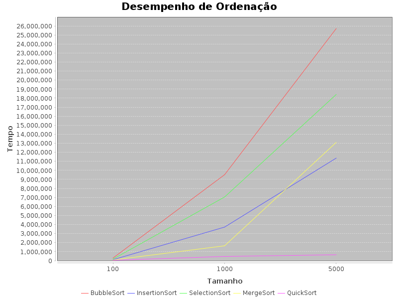

# 🚀 Algolab

Framework para análise de desempenho de algoritmos com geração automática de métricas, arquivos CSV e gráficos.

---

## 📊 Visão Geral

O **Algolab** é uma plataforma experimental para avaliar o desempenho de algoritmos de forma prática, permitindo:

* execução de benchmarks
* coleta de métricas de tempo
* geração automática de gráficos
* comparação entre algoritmos

---

## 🏷️ Status


---

## ✨ Funcionalidades

* 🔁 Execução automatizada de benchmarks
* 📁 Geração de resultados em CSV
* 📊 Geração automática de gráficos (.png)
* ⚙️ Arquitetura modular (busca, ordenação, estruturas)
* 📈 Comparação entre algoritmos
* 🧪 Execução reprodutível

---

## 📊 Exemplo de Resultado

Após execução, o projeto gera:

```text
resultados/
├── ordenacao.csv
├── busca.csv
├── estruturas.csv
└── graficos/
    ├── ordenacao.png
    ├── busca.png
    └── estruturas.png
```

### 📈 Gráfico de desempenho



---

## 🚀 Como Executar

### ✔ Pré-requisitos

* Java 21
* Gradle

---

### ▶️ Rodar o projeto

```bash
./gradlew run
```

---

## 📂 Estrutura do Projeto

```text
src/main/java/br/upe/analisealgoritmos
├── busca/          # algoritmos de busca
├── ordenacao/      # algoritmos de ordenação
├── estruturas/     # estruturas de dados
├── utils/          # utilitários (CSV, gráficos)
└── experimentos/   # execução dos testes
```

---

## 🧠 Conceitos Aplicados

* Análise de algoritmos
* Complexidade computacional (Big-O)
* Benchmarking
* Estruturas de dados
* Programação orientada a objetos
* Separação de responsabilidades

---

## 📌 Exemplos de Algoritmos

### 🔹 Ordenação

* Bubble Sort
* Insertion Sort
* Selection Sort
* Merge Sort
* Quick Sort

### 🔹 Busca

* Busca Linear
* Busca Binária

### 🔹 Estruturas

* Vetor Dinâmico
* Tabela Hash (Linear Probing)

---

## 🔮 Próximos Passos

* 🌐 Dashboard web interativo
* 📊 Comparação histórica de execuções
* 🤖 Integração com CI/CD
* 📉 Análise estatística avançada
* 📦 Exportação de relatórios em PDF

---

## 👩‍💻 Autoria

Projeto desenvolvido para estudo de análise de algoritmos e experimentação prática.

---

## 📜 Licença

Este projeto é de uso acadêmico e educacional.
